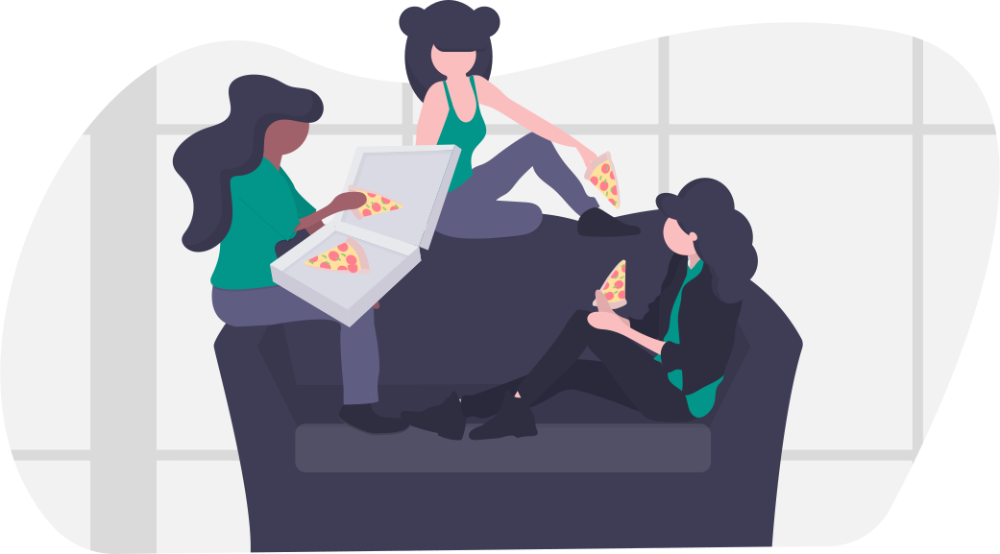

I’ve had a personal account on Facebook for well over a decade, but I’ve been inactive on that social media platform for a few years. During that inactive period I checked in a couple of times but considered my account dormant. I finally exported my photos and greenlit the deletion of my account.

Why? I lost interest in the platform. 

## Nostalgia for the pre-Facebook era

It used to be that if you wanted to socialize there were 2 options: by phone or in person. In person was always the preferred default and the norm. Only if your friends or relatives lived far away did you resort to phone calls. 

The more I’ve reminisced about this, the more I’ve questioned the value I get from newsfeed-based social media platforms like Facebook and Twitter. 

Reading Cal Newport's <em><a href="https://www.amazon.com/Digital-Minimalism-Choosing-Focused-Noisy/dp/0525542876/" target="blank">Digital Minimalism</a></em>  reinforced my questioning. Interestingly, Newport has never had a social media account. He doesn't spend much time surfing the web either. "As a result, my phone plays a relatively minor role in my life," he notes.

It's perhaps not surprising that there is a short time overlap between the advent of social media and the prophetic goal voiced by the CEO of Ericsson who promised to make the cellphone the center of the consumer's universe. 

For me, post-pandemic, I'm looking forward to prioritizing offline socializing.

## Escaping the walled garden

When I last logged in, I noticed Facebook’s user interface (UI) had changed considerably. I didn’t particularly care for the new design, which seemed busier. 

Also, Facebook has become much more of a walled garden: a one-stop shop designed to contain you like a steel ball in a pinball machine. You ping about, setting off 'buzzers' and getting 'rewards' while they collect behavioral data on you to sell to others.

This, of course, can easily lead to wasted time. I always have better things to do with my time than to be on Facebook.

<blockquote class="twitter-tweet">
Whatever you’re doing right now is the best use of your time, according to you.
&mdash; Sahil (@shl) <a href="https://twitter.com/shl/status/1383072769793925123?ref_src=twsrc%5Etfw">April 16, 2021</a></blockquote> 

## The warden and the fools

Before formally shutting my account down I caught my first glimpse of Facebook’s “warning” notes: correctives it dutifully pastes like a Victorian schoolmarm onto people’s comments that it finds problematic. These I saw on a friend’s newsfeed - who in frustration, reacted with the humorous epithet: “fascistbook!”

The idea of seeing individual warning labels stuck like annoying Post-its on people’s casual comments is definitely not appealing. 

Consider: 
* A professor and author recently had such a warning label appended to a comment of his, because he linked to a page he was criticizing. (Guilt by association.) 
* Similarly, a Princeton fellow and biologist had a video interview flagged because his interview subject voiced concerns about mutations that might result from the rollout of the COVID-19 vaccine. 

### Interventionists and the Lure of the Transgressive

First, if people’s minds are really so feeble that they need all sorts of assists and crutches just to make their way through what are usually low-definition social media posts, then it’s a problem that Post-it notes aren’t going to fix. Indeed, outsourcing our thinking (and therefore agency) to others is part of the larger, underlying societal fault line. 

Secondly, even if the Post-it note is accurate (and that's a big 'if' given nuanced problems that have ensued), is there any evidence that these notes change people’s minds? Do they perhaps make people <em>more</em> interested in the comment, once it’s labeled — implicity —  subversive or <em>transgressive</em>?

> Does social disapproval, via 'warning labels,' promote independent thinking or its opposite?

Such an ecosystem has zero appeal to me. I don’t need Facebook’s omnipresent hall monitors (whether algorithmic or otherwise) to do my thinking for me. 

## Busybodies Push Facebook Into the Strait of Messina

Facebook has an opt-in, opt-out system. That’s the best you can get with marketing. Like it? Join and stay. Don’t like it? Don’t join or leave. 

Facebook became powerful because billions of consumers said “Yes, we like this!” 

Nothing needed to be “done” to Facebook to “fix” it. This is something perpetual busybodies don’t understand. (The world would perhaps be a far kinder, better place if said busybodies attended to ridding themselves of their own hypocrisies and errors in thinking, rather than trying to police others.)

### Antitrust, Censorship, and Narrative Shaping

Now, I’ve criticized this “Post-it” note system for its flaws and for the lack of evidence that it produces a needed benefit, but my contention is it’s not designed to work. It’s designed to buy off Facebook’s political bullies, who’ve pushed the social media giant between the Scylla of threatened <a href="https://newsfilter.io/articles/why-facebook-and-google-face-the-most-risk-in-an-overhaul-of-antitrust-law-c2c1d6a16a2bd9a9cb0125e2f4f9e1c7" target="blank">antitrust action</a> (on the right primarily, but also the left) and the Charybdis of “Make people stop saying things we find abhorrent!” (on the left).

Facebook has struck a bargain with Charybdis which may not save it from rocky crags of Scylla. 

In the meantime, unfortunately, we'll be treated to the continuing spectacle of politicians on the right and left grilling Zuckerberg in public Kabuki theater, and fighting for greater control of Facebook, a powerful platform. 

The signs of this political struggle are strewn across Facebook's newsfeeds.

## In Sum

Mr. Zuckerberg, thanks for all the good times. I've had a lot of laughs and fun on Facebook, sharing photos and humor. I've played games and been entertained. I've enjoyed seeing my friends' updates and having conversations as well as learning things from my brainy friends' Facebook Notes. But this is not the best use of my time.

Besides, conversation fails to feel natural (or appealing) knowing every word you're typing is being watched and weighed, as a bureaucratic functionary or its algorithmic stand-in decide whether your ideas warrant social disapproval.

No thanks. 

 

### Why discuss this on SignalFox? 

Given this was my personal Facebook account, you may be wondering why I chose to publish this post on a business website. I've been reading and encountering in conversations, (1) greater pushback against the idea that Facebook is important or critical to business, and (2) a trend - albeit unmeasured - of disillusioned individuals leaving Facebook. 

I'm interested in whether these phenomena will develop into a significant trend. For that reason, I'll continue to share related information here that I believe our readers will find of interest.

Facebook advertising continues to be a powerful way to <a href="/see-think-do-model">boost initial awareness</a> for a brand, and to entice people to begin learning more about your business. But YouTube (with its long-form podcasts and videos) and your website are two of the best platforms for fostering in-depth exploration. 
